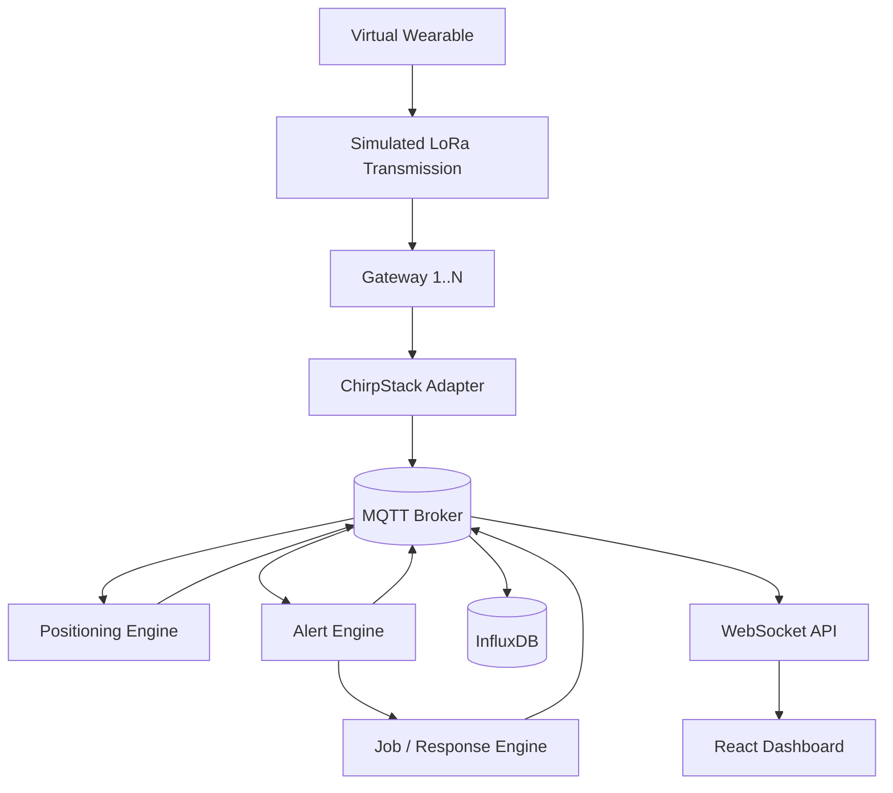
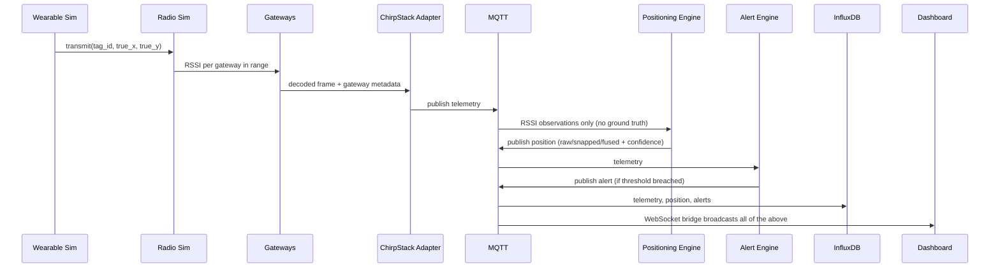
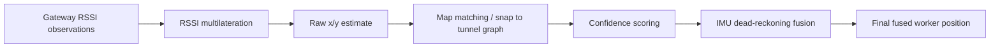
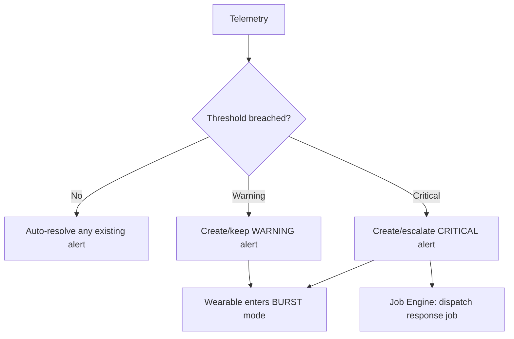
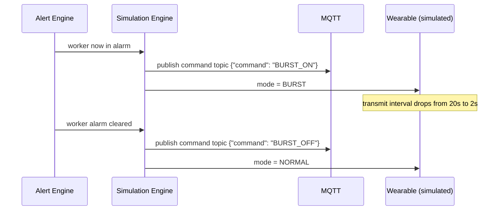
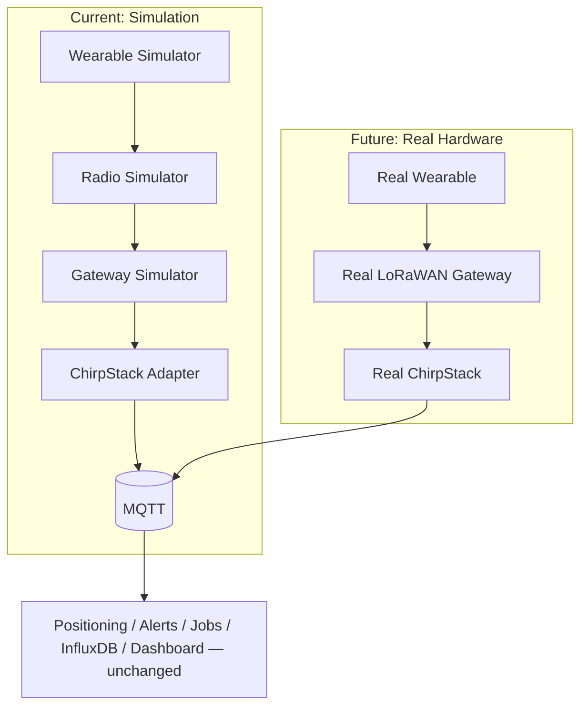

# Architecture

## 1. Complete system architecture



The simulator never talks to the dashboard directly. Everything the dashboard
shows has passed through the same MQTT boundary that real hardware would use.

## 2. Data flow



## 3. MQTT topics

```
mine/section3/wearable/{tag_id}/telemetry
mine/section3/wearable/{tag_id}/position
mine/section3/wearable/{tag_id}/alert
mine/section3/wearable/{tag_id}/command
mine/section3/gateway/{gw_id}/status
mine/section3/job/{job_id}
```

## 4. Positioning pipeline



Multilateration (`positioning/multilateration.py`) only ever receives
`RssiObservation` objects — there is no code path from it back to a worker's
true coordinates (enforced by `test_positioning.py::test_positioning_pipeline_never_receives_ground_truth`).
Map matching (`positioning/map_matching.py`) then snaps that estimate onto
the nearest point on the tunnel graph, guaranteeing the reported position
can never sit inside solid rock. Between radio fixes, `positioning/imu_fusion.py`
advances the last snapped position using the worker's actual simulated
displacement each tick, so the dashboard sees smooth movement rather than a
jump once per transmit interval; its confidence score decays until the next
real fix arrives.

## 5. Alert pipeline



Fall and panic-button events bypass the threshold check entirely — they are
CRITICAL by definition and raise an alert (and dispatch a job) immediately.

## 6. Burst mode sequence



## 7. Hardware migration path



`TelemetrySource`, `GatewaySource`, and `RadioTransport` (see `simulator/`)
are the seams: everything downstream of MQTT depends only on the topic
contracts, never on the simulator's internals, so swapping in
`LoRaTelemetrySource` / `RealGatewaySource` later requires no changes to
`positioning/`, `alerts/`, `jobs/`, `database/`, or the dashboard.
